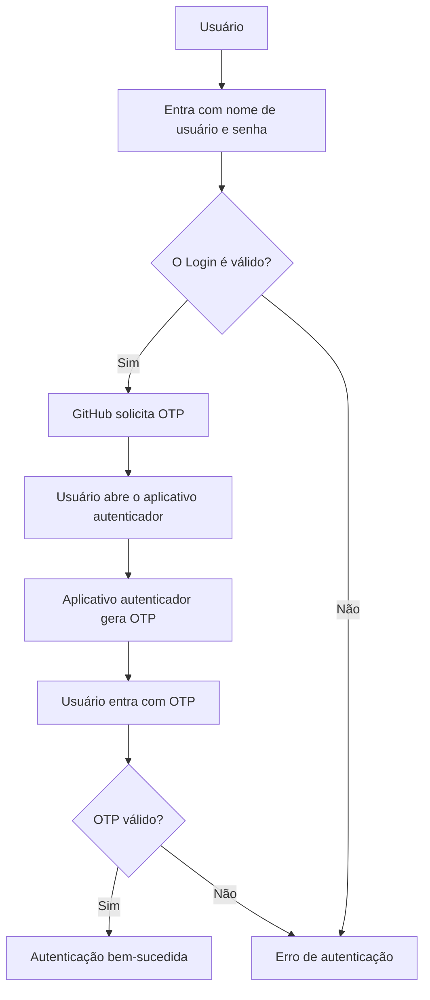
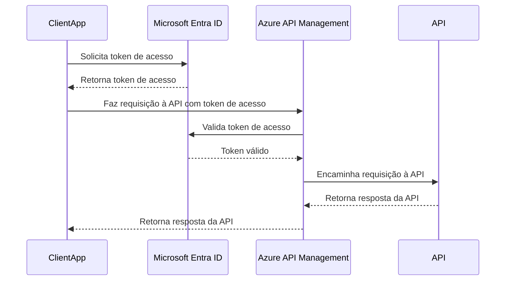
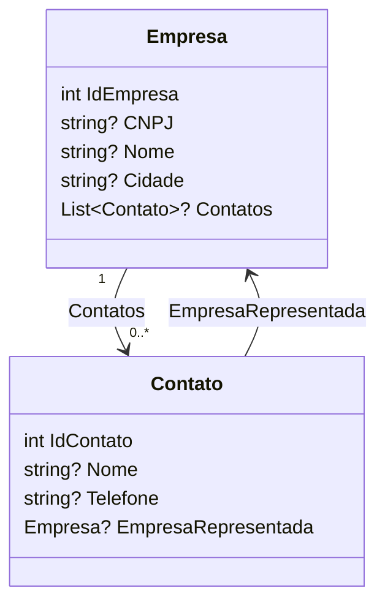
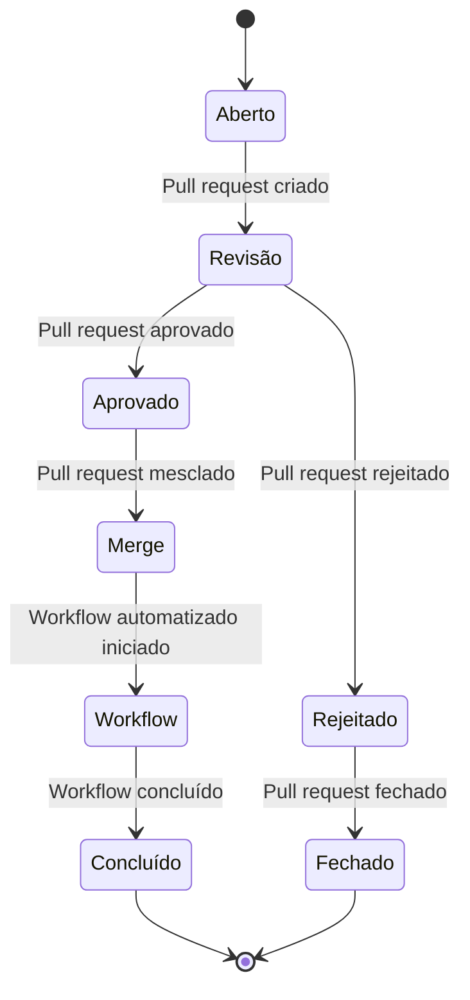
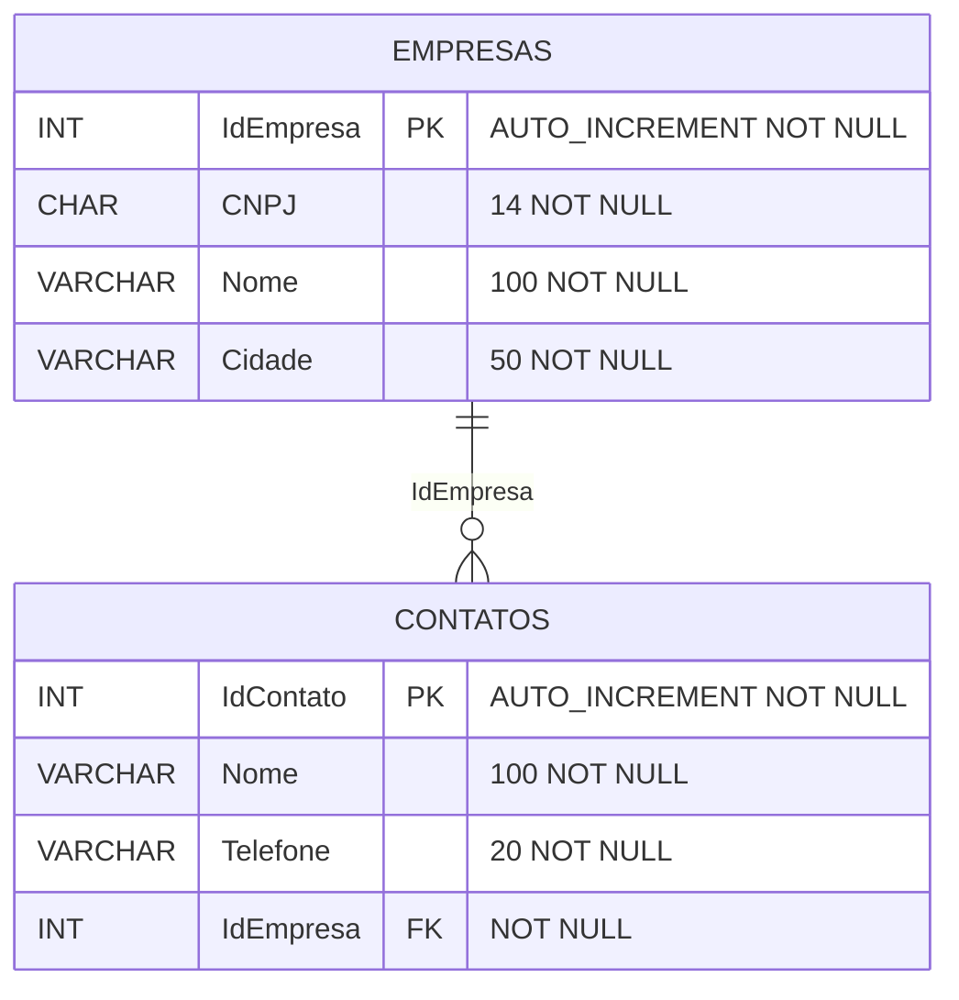
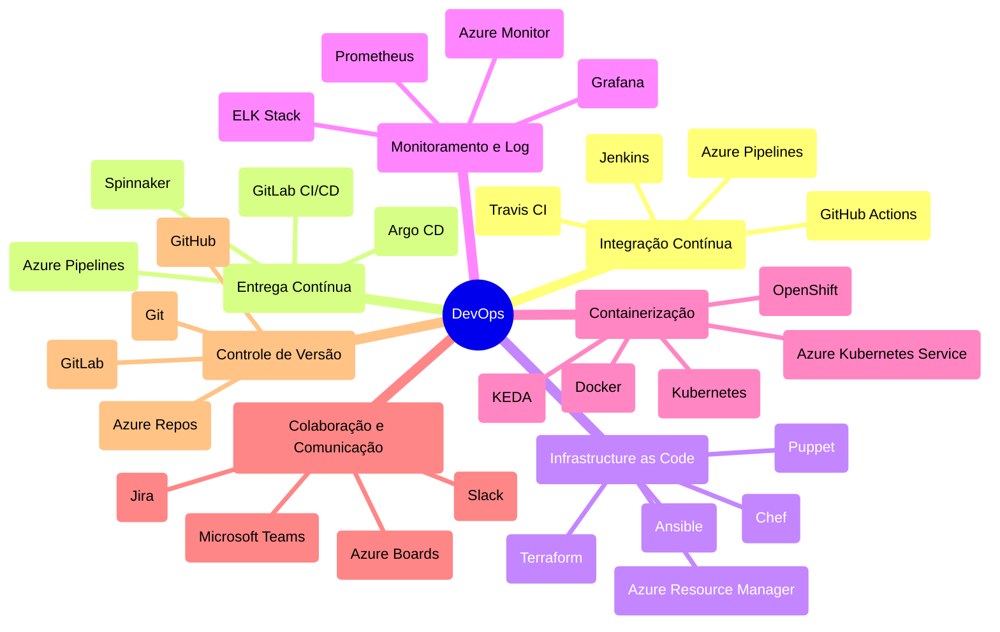

# Mermaid-Copilot_TDCSummitIABrasilia
Materiais da apresentação "Inteligência Artificial + Documentação de Projetos -- Utilizando GitHub Copilot + Mermaid para documentar soluções". Palestra realizada durante o TDC Summit IA Brasília em 24/10/2024.

---

31 pessoas

24/10/2024 (quinta-feira)

---

---

## Exemplos

### Fluxograma

Pergunta ao Copilot:

```
Gere para mim um diagrama em Mermaid que demonstre o fluxo de autenticação no GitHub, lembrando que se está utilizando MFA com OTP
```

Resposta:



---

### Diagrama de Sequência

Pergunta ao Copilot:

```
Gere para mim em Mermaid um diagrama de sequência que demonstre o fluxo para se autenticar em uma API protegida com o Azure API Management e que faz uso do Microsoft Entra ID...
```

Resposta:



### Diagrama de classes

Gerando um diagrama de classes para a implementação:

```csharp
using System.ComponentModel.DataAnnotations;
using System.ComponentModel.DataAnnotations.Schema;
using System.Text.Json.Serialization;

namespace BenchmarkingDapperEFCoreCRMPostgres.EFCore;

public class Empresa
{
    [Key]
    public int IdEmpresa { get; set; }
    public string? CNPJ { get; set; }
    public string? Nome { get; set; }
    public string? Cidade { get; set; }
    public List<Contato>? Contatos { get; set; }
}

public class Contato
{
    [Key]
    public int IdContato { get; set; }
    public string? Nome { get; set; }
    public string? Telefone { get; set; }

    [ForeignKey("IdEmpresa")]
    [JsonIgnore]
    public Empresa? EmpresaRepresentada { get; set; }
}
```

Resposta do Copilot:



---

### Diagrama de Estados

Pergunta ao Copilot:

```
Gere para mim em Mermaid um diagrama de estados representando um fluxo de aprovação de pull requests no GitHub e execução automatizada de workflows quando isso acontecer...
```

Resposta:



---

### Diagrama de Entidades-Relacionamentos

Pergunta ao Copilot:

```
Gere para mim em Mermaid um diagrama de entidades-relacionamentos para o seguinte script:
```

```sql
CREATE DATABASE BaseCRMEF;

USE BaseCRMEF;

CREATE TABLE Empresas (
    IdEmpresa INT AUTO_INCREMENT NOT NULL,
    CNPJ CHAR(14) NOT NULL,
    Nome VARCHAR(100) NOT NULL,
    Cidade VARCHAR(50) NOT NULL,
    PRIMARY KEY (IdEmpresa)
);

CREATE TABLE Contatos (
    IdContato INT AUTO_INCREMENT NOT NULL,
    Nome VARCHAR(100) NOT NULL,
    Telefone VARCHAR(20) NOT NULL,
    IdEmpresa INT NOT NULL,
    PRIMARY KEY (IdContato),
    FOREIGN KEY (IdEmpresa) REFERENCES Empresas(IdEmpresa)
);
```

Resposta:



---

### Mindmap

Pergunte ao Copilot:

```
Gere para mim um mindmap em Mermaid com tópicos, conceitos e ferramentas importantes para se trabalhar ou adotar a cultura DevOps
```

Resposta:


