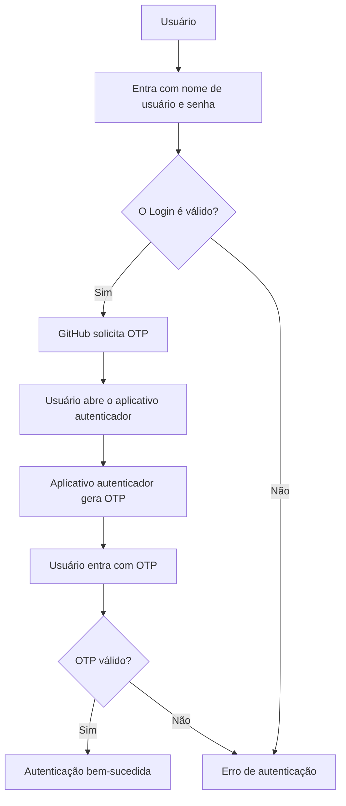
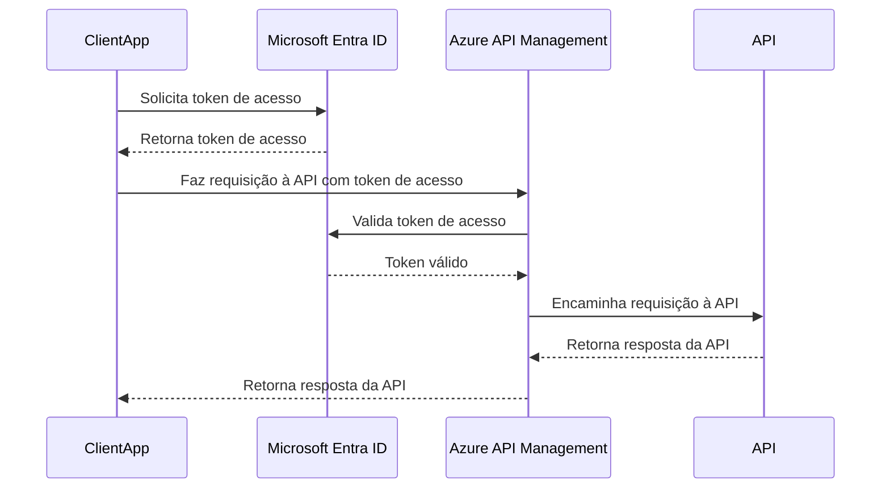

# Mermaid-Copilot_TDCSummitIABrasilia
Materiais da apresentação "Inteligência Artificial + Documentação de Projetos -- Simplificando a geração de documentações com Inteligência Artificial". Palestra realizada durante o TDC Summit IA Brasília em 24/10/2024.

## Exemplos

### Fluxograma

Pergunta ao Copilot:

```
Gere para mim um diagrama em Mermaid que demonstre o fluxo de autenticação no GitHub, lembrando que se está utilizando MFA com OTP
```

Resposta:



---

### Diagrama de Sequência

Pergunta ao Copilot:

```
Gere para mim em Mermaid um diagrama de sequência que demonstre o fluxo para se autenticar em uma API protegida com o Azure API Management e que faz uso do Microsoft Entra ID...
```

Resposta:

